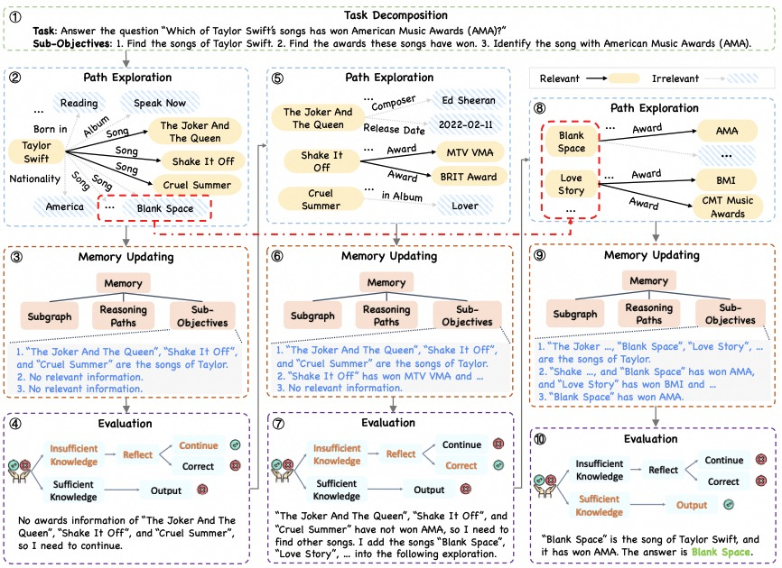

# [NeurIPS 2024] Plan-on-Graph: Self-Correcting Adaptive Planning of Large Language Model on Knowledge Graphs

Codes for the paper titled ["Plan-on-Graph: Self-Correcting Adaptive Planning of Large Language Model on Knowledge Graphs"](https://arxiv.org/pdf/2410.23875), published in Proceedings of the 38th Annual Conference on Neural Information Processing Systems (NeurIPS'2024).




## Knowledge Graph and Datasets
Before executing PoG, you need to deploy **Freebase** on your local machine. Please follow the [installation instructions](https://github.com/GasolSun36/ToG/tree/main/Freebase).
We utilize CWQ, WebQSP, and GrailQA datasets to evaluate PoG. These datasets are located in `data/` with aliases in `cope_alias/`.

## Code
Our codes are modified based on the public project [ToG](https://github.com/GasolSun36/ToG). We appreciate the authors for making ToG open-sourced. 

### Running
After installing all necessary configurations, you can execute PoG using the following command:
```sh
python main_freebase.py \  
--dataset cwq \ # the dataset
--max_length 4096 \ # the max length of LLMs output
--temperature_exploration 0.3 \ # the temperature in exploration stage
--temperature_reasoning 0.3 \ # the temperature in reasoning stage
--depth 4 \ # the search depth
--remove_unnecessary_rel True \ # whether removing unnecessary relations
--LLM_type gpt-3.5-turbo \ # the LLM
--opeani_api_keys sk-xxxx \ # your own api keys
```

```sh
python main_yago.py \
--dataset cwq \ # the dataset
--max_length 4096 \ # the max length of LLMs output
--temperature_exploration 0.3 \ # the temperature in exploration stage
--temperature_reasoning 0.3 \ # the temperature in reasoning stage
--depth 4 \ # the search depth
--remove_unnecessary_rel True \ # whether removing unnecessary relations
--LLM_type gpt-3.5-turbo \ # the LLM
--opeani_api_keys sk-xxxx \ # your own api keys
```

All prompts used in experiments are in the `prompt_list.py` file.

### Evaluation
We use **Exact Match** as the evaluation metric. After obtaining the final result file, please evaluate the results using the following command:

```sh
python eval.py \  
--dataset cwq \ # the dataset
--output_file PoG_cwq_gpt-3.5-turbo.jsonl \ # the result file
```


# Citation
If you are interested in or inspired by this work, please kindly cite it as follows:
```sh
@inproceedings{chen2024pog,
	title={Plan-on-Graph: Self-Correcting Adaptive Planning of Large Language Model on Knowledge Graphs},
	author={Chen, Liyi and Tong, Panrong and Jin, Zhongming and Sun, Ying and Ye, Jieping and Xiong, Hui},
	booktitle={Proceedings of the 38th Conference on Neural Information Processing Systems},
	year={2024}
}
```


# Claims
This project is licensed under the Apache 2.0 license. The project assumes no legal responsibility for any outputs from the model and will not be held liable for any damages resulting from the use of the resources and outputs.

